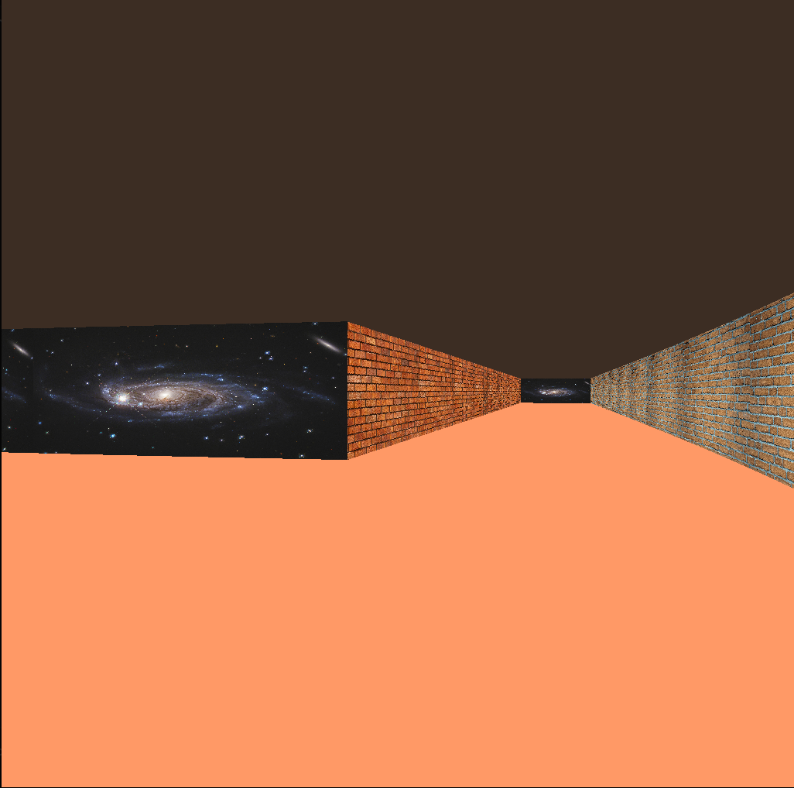

*This project has been created as part of the 42 curriculum by mcuello and asgalean.*
# Cub3D

---

## Preview

<p align="center">
  
</p>

---

## Description

cub3D is a first-person 3D maze explorer inspired by the legendary game Wolfenstein 3D, one of the first FPS games ever made. The goal is to render a navigable 3D environment from a 2D map using raycasting — a technique that simulates perspective by casting rays from the player's viewpoint and calculating the distance to the nearest wall for each vertical column of the screen.

The project is written in C and uses **MLX42** as the graphics library for window management and pixel rendering. Map configuration, wall textures, and floor/ceiling colors are all loaded from a `.cub` file at runtime.

Key features:

- Raycasting engine with horizontal and vertical wall detection
- Textured walls with correct perspective mapping (fisheye correction included)
- Four directional textures (North, South, East, West)
- Configurable floor and ceiling colors (RGB)
- Smooth player movement and rotation
- Collision detection against walls
- `.cub` map file parser with validation

---

## Instructions

### Requirements

- Linux (Ubuntu/Debian recommended)
- The [MLX42](https://github.com/codam-coding-college/MLX42) graphics library cloned into the same directory as the project

```
git clone https://github.com/codam-coding-college/MLX42.git
```

### Compilation

```
make
```

This will automatically build libft and MLX42, then compile the project into the `cub3d` executable.

To clean object files:

```
make clean
```

To fully clean including the binary and MLX42 build:

```
make fclean
```

To recompile from scratch:

```
make re
```

### Execution

```
./cub3d <path/to/map.cub>
```

Example:

```
./cub3d maps/square_map.cub
```

### Map format (.cub)

The `.cub` file must contain the following elements before the map:

```
NO ./path/to/north_texture.png
SO ./path/to/south_texture.png
WE ./path/to/west_texture.png
EA ./path/to/east_texture.png

F R,G,B
C R,G,B
```

Followed by the map itself, made up of:

- `1` — wall
- `0` — empty space
- `N`, `S`, `E`, or `W` — player start position and facing direction

The map must be fully enclosed by walls.

### Controls

| Key         | Action        |
| ----------- | ------------- |
| `W`         | Move forward  |
| `S`         | Move backward |
| `A`         | Strafe left   |
| `D`         | Strafe right  |
| `←`         | Rotate left   |
| `→`         | Rotate right  |
| `ESC` / `Q` | Quit          |

---

## What I learned

- How raycasting works: casting a ray per screen column and using DDA
  (Digital Differential Analysis) to find the nearest wall intersection
  efficiently
- Correcting the fisheye distortion that raycasting produces by default,
  by adjusting distances relative to the camera plane rather than the
  raw ray length
- Mapping 2D textures onto 3D wall slices based on exactly where the ray
  hit the wall, including choosing the correct texture (N/S/E/W) based on
  which side of the wall was hit
- Parsing and validating a custom file format (`.cub`) before allowing
  the game to start, including textures, colors, and map layout
- Working with the MLX42 API for window management, image buffers, pixel
  rendering, and the game loop
- Debugging with valgrind against a library (MLX42) that produces its own
  internal leaks unrelated to project code, and how to filter those out
  with suppression files to validate memory management correctly

---

## Resources

### Raycasting & 3D rendering

- [Wolfenstein 3D (Wikipedia)](https://en.wikipedia.org/wiki/Wolfenstein_3D) — context and history of the technique

- Our colleague and friend xortega — explanation and introduction to raycasting.

### MLX42

- [MLX42 GitHub repository](https://github.com/codam-coding-college/MLX42) — official documentation and API reference

### AI usage

Claude (Anthropic) was used throughout this project as an assistant for the following tasks:

- **Raycasting math**: Helping explaining the idea behind texture coordinate mapping (`wall_percent`, `tex_pos`)
- **Debugging and code review**: Helping identify specific bugs after many hours of not finding an error.
- **MLX42 integration**: Explaining the MLX42 API (`mlx_init`, `mlx_new_image`, `mlx_put_pixel`, `mlx_loop_hook`, `mlx_load_png`, `mlx_delete_texture`, etc.)

All code was written, reviewed, and validated by the team.

---

## Notes

The leaks showed when using valgrind are entirely due to MLX42.
This can be checked with:

```
valgrind --leak-check=full --gen-suppressions=all ./cub3d maps/square_map.cub 2> raw.supp
```

Then extract the `{...}` blocks from `raw.supp` using the following Python script:

```python
with open('raw.supp') as f:
    content = f.read()

blocks = []
in_block = False
current = []

for line in content.splitlines():
    if line.strip() == '{':
        in_block = True
        current = ['{']
    elif line.strip() == '}' and in_block:
        current.append('}')
        blocks.append('\n'.join(current))
        in_block = False
        current = []
    elif in_block:
        current.append(line)

with open('mlx42.supp', 'w') as f:
    f.write('\n'.join(blocks))
```

Save it as `extract.py` and run with `python3 extract.py`.
Then run with:

```
valgrind --suppressions=./mlx42.supp ./cub3d maps/square_map.cub
```